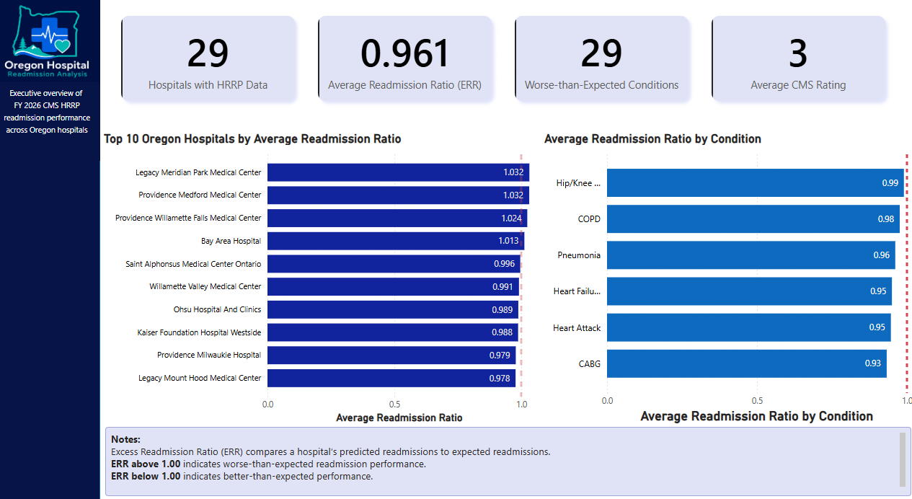
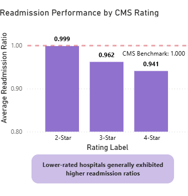
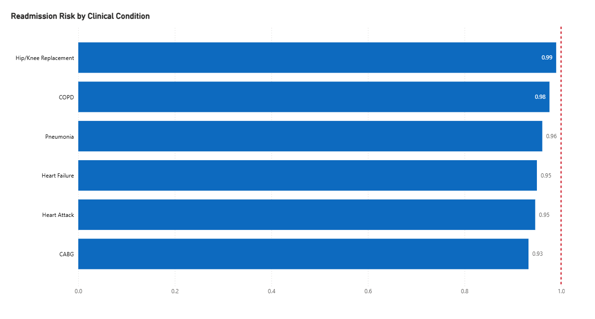
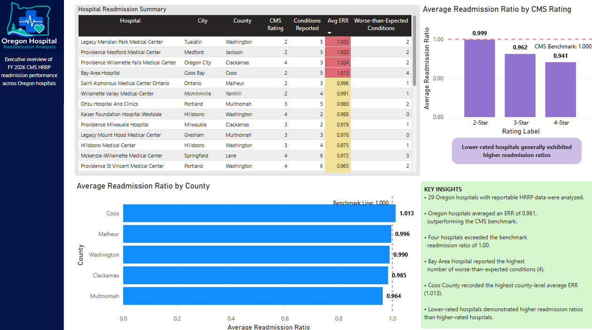

# Oregon Hospital Readmission Analysis

### Identifying Operational Drivers of Readmission Risk Across Oregon Hospitals

---

## Client Background

Hospital readmissions are a major quality and financial concern for healthcare organizations. Under the Centers for Medicare & Medicaid Services Hospital Readmissions Reduction Program, hospitals with excess readmissions may face reduced Medicare reimbursement.

This analysis evaluates **FY2026 Oregon hospital readmission performance** across **29 hospitals** with reportable HRRP data. The goal was to identify which hospitals, clinical conditions, CMS quality rating groups, and counties demonstrated elevated readmission risk.

The analysis was designed for healthcare operations and quality leaders who need to prioritize intervention efforts, improve care-transition processes, and reduce potential reimbursement exposure.

---
## Interactive Dashboard

[View Interactive Power BI Dashboard](https://app.powerbi.com/view?r=eyJrIjoiZTA0ZTkzMTktNjRmMy00MzcwLWIyZDEtOGQzYjlhNWEzY2Q5IiwidCI6ImYyNTUyZTQ3LTkzMTYtNDBmYy05ZjAwLTdmODU4MmMxYTFkMyIsImMiOjZ9)

[Download Power BI File]([dashboards/oregon_hospital_readmission.pbi](https://github.com/romandkuang/oregon-hospital-readmission-analysis/blob/main/dashboards/oregon_hospital_readmission.pbit)x)

## Northstar Metrics

| Metric | Definition | Business Purpose |
|---|---|---|
| Average Readmission Ratio | Average Excess Readmission Ratio across reported conditions | Measures whether hospitals are performing better or worse than CMS expectations |
| Hospitals Above Benchmark | Count of hospitals with Average ERR above 1.00 | Identifies facilities with elevated readmission risk |
| Worse-than-Expected Conditions | Count of condition-level records exceeding expected performance | Highlights the breadth of underperformance across service lines |
| Average CMS Rating | Average CMS Overall Hospital Rating across analyzed hospitals | Provides a quality-performance segmentation lens |

**Benchmark interpretation:**  
ERR above **1.00** indicates worse-than-expected readmission performance.  
ERR below **1.00** indicates better-than-expected readmission performance.

---

# Executive Summary

## Hospital Readmission Performance Analysis

1. **Readmission risk was concentrated in a small subset of hospitals**
   - Only **4 of 29 Oregon hospitals**, or **13.8%**, exceeded the CMS benchmark readmission ratio of **1.00**.
   - This indicates elevated risk is not broadly distributed across Oregon hospitals. Instead, a small group of facilities is driving the majority of above-benchmark exposure.
   - A targeted intervention strategy focused on these hospitals may generate greater operational impact than broad statewide quality-improvement programs.

2. **Statewide average performance was better than expected**
   - Oregon hospitals averaged an ERR of **0.961**, outperforming the CMS benchmark of **1.00**.
   - While the statewide average suggests favorable performance overall, facility-level analysis revealed important variation that would be hidden if leadership only reviewed aggregate results.
   - This reinforces the need for hospital-level monitoring alongside statewide KPI reporting.

3. **CMS quality ratings were associated with readmission performance**
   - Hospitals with **4-star CMS ratings** averaged an ERR of **0.941**, compared with **0.999** for 2-star hospitals.
   - This represents a **5.8% lower readmission ratio** among 4-star hospitals compared with 2-star facilities.
   - Although the analysis does not establish causation, the pattern suggests stronger quality-management systems may be associated with better care coordination, discharge planning, and patient follow-up.

4. **Condition-level risk was highest in orthopedic and respiratory care**
   - **Hip/Knee Replacement**, **COPD**, and **Pneumonia** demonstrated the highest average readmission ratios across Oregon hospitals.
   - These service lines represent priority areas for targeted care-pathway improvement, especially around discharge planning, rehabilitation coordination, medication management, and follow-up scheduling.

---

## Dataset Structure and Analytical Model

The analysis combines CMS hospital readmission performance data with CMS hospital information data. The final model supports hospital-level, condition-level, rating-level, and county-level performance analysis.

    CMS Hospital General Information
            │
            │ Facility ID
            ▼
    CMS HRRP Readmission Performance
            │
            ├── Hospital-Level Analysis
            ├── Condition-Level Analysis
            ├── CMS Rating Analysis
            └── County-Level Analysis

### Analytical Grain

Each row in the core analytical dataset represents a hospital-condition reporting record.

| Dataset Layer | Description |
|---|---|
| Hospital Information | Facility name, city, county, CMS rating |
| Readmission Performance | Condition name, Excess Readmission Ratio, performance classification |
| Geography | County-level and city-level hospital location |
| Quality Rating | CMS Overall Hospital Rating used for segmentation |

---

# Insights Deep-Dive

# Hospital Readmission Performance

## Only 13.8% of Hospitals Exceeded CMS Benchmarks

Readmission risk was concentrated among a small number of facilities rather than distributed evenly across Oregon hospitals.

| Hospital | Average ERR |
|---|---:|
| Legacy Meridian Park Medical Center | 1.032 |
| Providence Medford Medical Center | 1.032 |
| Providence Willamette Falls Medical Center | 1.024 |
| Bay Area Hospital | 1.013 |

1. **A small number of facilities drove above-benchmark risk**
   - Only **4 of 29 hospitals** exceeded the CMS benchmark of **1.00**.
   - This means approximately **86.2%** of Oregon hospitals performed at or below the CMS readmission benchmark.
   - From an operations perspective, this suggests leadership should avoid treating readmission risk as a uniform statewide issue.

2. **Targeted quality improvement is likely more efficient than broad intervention**
   - Since elevated risk is concentrated, the highest-return strategy is to prioritize the four above-benchmark hospitals.
   - Operational reviews should focus on discharge workflows, follow-up scheduling, medication reconciliation, and patient handoff processes.
   - This approach allows healthcare leaders to direct limited quality-improvement resources toward facilities with the clearest performance gaps.

---

# CMS Rating Performance

## Higher-Rated Hospitals Consistently Outperformed Lower-Rated Facilities

Average readmission performance improved as CMS quality ratings increased.

| CMS Rating | Average ERR |
|---|---:|
| 2-Star | 0.999 |
| 3-Star | 0.962 |
| 4-Star | 0.941 |

1. **4-star hospitals demonstrated stronger readmission performance**
   - Hospitals rated **4 stars** achieved an average ERR of **0.941**, compared with **0.999** for 2-star hospitals.
   - This reflects a **5.8% lower readmission ratio** for 4-star hospitals compared with 2-star hospitals.
   - The result suggests higher-rated hospitals may have stronger operational practices supporting discharge planning, care coordination, and post-discharge follow-up.

2. **Quality rating may serve as a useful segmentation lens**
   - CMS rating alone does not explain readmission outcomes, but it provides a useful way to segment hospital performance.
   - The downward trend from **0.999** to **0.962** to **0.941** indicates a consistent relationship between higher quality ratings and better readmission performance.
   - Healthcare leaders can use this pattern to identify best practices from higher-rated facilities and evaluate whether those practices can be transferred to lower-rated hospitals.

---

# Condition Performance

## Orthopedic and Respiratory Care Pathways Demonstrated Elevated Risk

The highest average readmission ratios were concentrated in orthopedic and respiratory-related conditions.

| Condition | Average ERR |
|---|---:|
| Hip/Knee Replacement | 0.990 |
| COPD | 0.976 |
| Pneumonia | 0.961 |
| Heart Failure | 0.950 |
| Heart Attack | 0.950 |
| CABG | 0.930 |

1. **Hip/Knee Replacement had the highest average readmission ratio**
   - Hip/Knee Replacement averaged an ERR of **0.990**, making it the highest-risk condition in the analysis.
   - Although still below the CMS benchmark of **1.00**, the condition is close enough to warrant operational attention.
   - Because orthopedic procedures often involve predictable care pathways, improvement opportunities may exist in rehabilitation planning, discharge readiness, and post-surgical follow-up.

2. **COPD and Pneumonia represent respiratory care-transition risks**
   - COPD averaged an ERR of **0.976**, while Pneumonia averaged **0.961**.
   - These conditions often involve complex patient populations, recurring exacerbation risk, medication adherence challenges, and follow-up care needs.
   - Quality-improvement teams should prioritize respiratory discharge protocols, patient education, and early post-discharge outreach.

3. **Condition-level targeting is more actionable than hospital-wide intervention**
   - The variation across conditions shows that readmission risk is not uniform across service lines.
   - A condition-specific strategy allows clinical and operations teams to design interventions around the unique risk drivers of each patient population.
   - This is more actionable than applying the same broad readmission reduction program across all conditions.

---

# Geographic Results

## Coos County Was the Only County to Exceed the CMS Benchmark

County-level analysis identified meaningful geographic variation in readmission performance.

| County | Average ERR |
|---|---:|
| Coos | 1.013 |
| Malheur | 0.996 |
| Washington | 0.990 |
| Clackamas | 0.985 |
| Multnomah | 0.964 |

1. **Coos County recorded the highest county-level readmission ratio**
   - Coos County averaged an ERR of **1.013**, making it the only county in the analysis to exceed the CMS benchmark.
   - This indicates county-level performance should be monitored separately from statewide averages.
   - Regional healthcare access, post-acute care availability, transportation barriers, and provider density may influence readmission outcomes.

2. **Near-benchmark counties should remain under observation**
   - Malheur County averaged **0.996**, while Washington County averaged **0.990**.
   - Although both remained below the benchmark, they were close enough to justify monitoring.
   - Small changes in hospital performance could push these counties above the benchmark in future reporting periods.

---

# Hospital Performance Dashboard

The hospital performance dashboard provides a detailed view of facility-level readmission patterns, condition-level risk, and benchmark comparison. This view supports operational review by helping stakeholders identify which hospitals are above benchmark, which conditions are closest to risk thresholds, and where intervention should be prioritized.

---

# Recommendations

#### Based on the uncovered insights, healthcare operations leaders can take the following actions.

## Hospital Operations

- Conduct targeted operational reviews of the four hospitals exceeding the CMS benchmark.
  - Legacy Meridian Park Medical Center and Providence Medford Medical Center recorded the highest average ERR values at **1.032**.
  - Providence Willamette Falls Medical Center averaged **1.024**, while Bay Area Hospital averaged **1.013**.
  - Reviews should focus on discharge planning, medication reconciliation, follow-up scheduling, and patient handoff processes.

- Establish monthly monitoring for hospitals near or above an ERR of **1.00**.
  - Hospitals slightly below the benchmark should not be ignored because small performance changes could create future reimbursement exposure.
  - Monitoring should prioritize facilities with repeated worse-than-expected conditions.

## Quality Improvement

- Develop condition-specific improvement programs for Hip/Knee Replacement, COPD, and Pneumonia.
  - Hip/Knee Replacement recorded the highest average ERR at **0.990**.
  - COPD and Pneumonia followed at **0.976** and **0.961**.
  - Each condition should have tailored interventions rather than a generic readmission reduction plan.

- Benchmark care-transition practices from higher-performing hospitals.
  - 4-star hospitals averaged an ERR of **0.941**, outperforming 2-star hospitals by **5.8%**.
  - Quality teams should evaluate whether higher-rated hospitals use stronger follow-up workflows, discharge education, or care coordination programs.

## Clinical Leadership

- Strengthen post-discharge outreach for high-risk service lines.
  - Respiratory conditions such as COPD and Pneumonia may benefit from earlier follow-up appointments and improved medication adherence checks.
  - Orthopedic patients may benefit from stronger rehabilitation coordination and discharge readiness assessments.

- Improve coordination between inpatient teams, outpatient providers, rehabilitation facilities, and care managers.
  - Readmissions often occur when patient transitions are not well coordinated across care settings.
  - Clinical leadership should treat readmission reduction as a cross-continuum care issue rather than a hospital-only metric.

## Regional Healthcare Stakeholders

- Prioritize regional investigation in Coos County.
  - Coos County was the only county exceeding the CMS benchmark, with an average ERR of **1.013**.
  - Local access barriers, transportation, provider availability, and post-acute care capacity should be reviewed.

- Monitor near-benchmark counties such as Malheur and Washington.
  - Malheur averaged **0.996** and Washington averaged **0.990**.
  - These counties are below benchmark but close enough to warrant continued monitoring and early intervention planning.

---

# Repository Structure

    oregon-hospital-readmission-analysis
    │
    ├── README.md
    │
    ├── dashboard
    │   └── Oregon_Hospital_Readmission_Analysis.pbit
    │
    ├── screenshots
    │   ├── executive_overview.png
    │   ├── cms_rating_analysis.png
    │   ├── condition_analysis.png
    │   └── hospital_details.png
    │
    ├── sql
    │   ├── 01_data_validation.sql
    │   ├── 02_hospital_analysis.sql
    │   ├── 03_condition_analysis.sql
    │   ├── 04_county_analysis.sql
    │   └── 05_cms_rating_analysis.sql
    │
    └── data
        └── data_sources.md

---

## Footer

**Romand Kuang**  
**Data Analyst**  |  **Healthcare Analytics** | **Business Intelligence**

**GitHub:** [github.com/romandkuang](https://github.com/romandkuang)  
**Power BI Dashboard:** [Download Dashboard](https://github.com/romandkuang/oregon-hospital-readmission-analysis/blob/main/dashboards/oregon_hospital_readmission.pbix)
